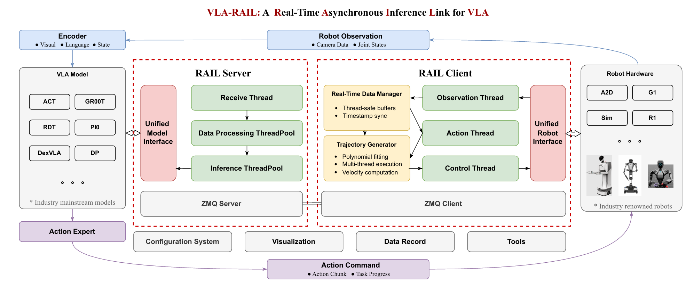

# VLA Large Model Inference Framework

## 1. Framework Overview

This is a comprehensive Vision-Language-Action (VLA) inference framework designed for robotic manipulation tasks. The framework provides a client-server architecture that enables real-time robot control using various VLA models including ACT, GR00T, RDT, and SmolVLA.

### 1.1 Architecture

The framework uses a client-server architecture with ZMQ for communication:



### 1.2 Framework Structure

```
.
├── client/                 # Client-side components
│   ├── core/              # Core client functionality
│   ├── robots/            # Robot implementations
│   └── utils/             # Utility functions
├── conf/                  # Configuration files
├── data/                  # Data storage
├── scripts/               # Utility scripts
├── server/                # Server-side components
│   ├── core/              # Core server functionality
│   └── models/            # VLA model implementations
├── run_client.py          # Client entry point
├── run_server.py          # Server entry point
└── README.md              # This file
```

## 2. Framework Usage

### 2.1 Configuration

All framework configuration items are defined in the `conf/` directory. Each component has its own configuration file:

- `client_conf.py` - Client configuration
- `server_conf.py` - Server configuration  
- `models_conf.py` - Model configuration
- `robots_conf.py` - Robot configuration
- `zmq_conf.py` - ZMQ communication configuration

### 2.2 Client

The client is responsible for:
- Obtaining observation data and robot state from the robot
- Sending data to the server
- Receiving inference results from the server
- Sending control commands to the robot

#### Supported Robots

Currently supported robots:

- **A2D Robot**: A2D humanoid robot - [Documentation](client/robots/a2d/README.md)
- **Mock Robot**: Simulation robot for testing

#### Running the Client

1. **Run Client**
   ```bash
   python run_client.py
   ```

2. **Client Command Line Options**
   ```bash
   python run_client.py --help
   ```

### 2.3 Server

The server handles VLA model inference and provides results to clients.

#### Supported Models

- **ACT**
- **GR00T N1**
- **GR00T N1.5** - [Documentation](server/models/gr00t/README.md)
- **RDT**
- **SmolVLA**

#### Running the Server

1. **Setup Model Environment**
   ```bash
   # For GR00T models
   conda activate gr00t
   
   # For other models, use appropriate environment
   ```

2. **Run Server**
   ```bash
   python run_server.py
   ```

3. **Server Command Line Options**
   ```bash
   python run_server.py --help
   ```
   
   Available options:
   - `--model_type`: Specify model type (act, gr00t_n1, gr00t_n1_5, rdt, smolvla)
   - `--model_path`: Path to model checkpoint

## 3. Additional Resources

### 3.1 Scripts

Utility scripts are available in the `scripts/` directory:

- **Data Visualization**: [LeRobot Data Viewer](scripts/show_lerobot_data/README.md)
- **Evaluation Tools**: [VLA Evaluation](scripts/vla_eval/README.md)
- **Robot Reset**: [A2D Robot Reset](scripts/reset_robot/README.md)

