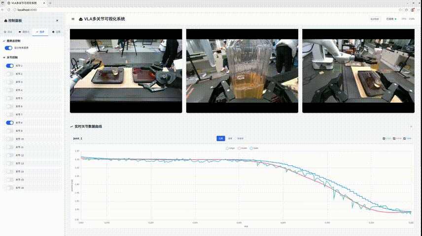
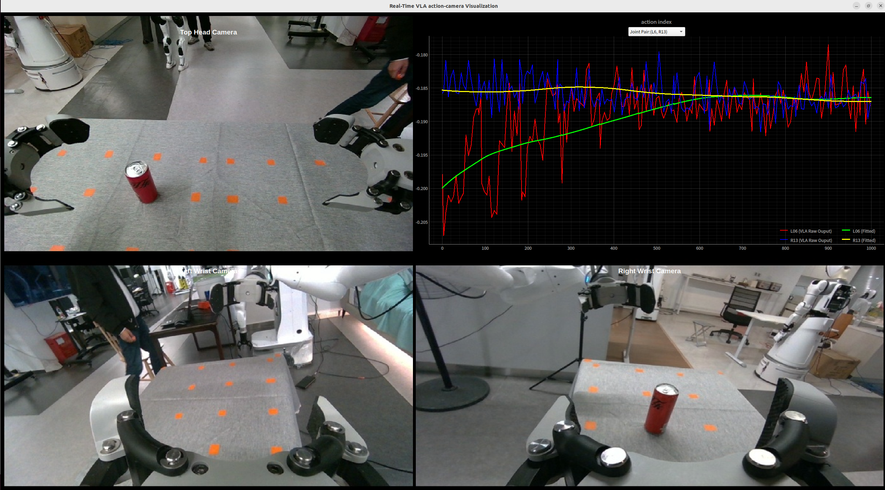
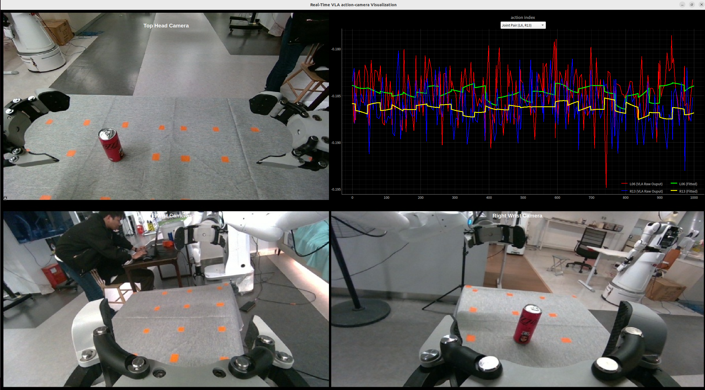
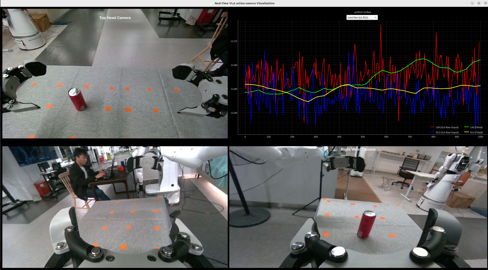
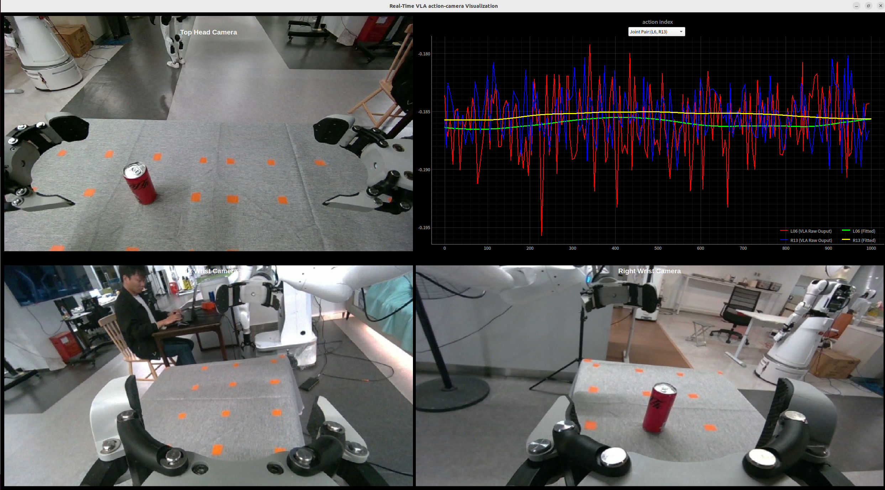

# VLA-RAIL: A Real-Time Asynchronous Inference Linker for VLA Models and Robots

## 1. Framework Overview

This is a comprehensive Vision-Language-Action (VLA) inference framework designed for robotic manipulation tasks. The framework provides a client-server architecture that enables real-time robot control using various VLA models including ACT, GR00T, RDT, SmolVLA, and GO1.

### 1.1 Architecture

The framework uses a client-server architecture with ZMQ for communication:


### 1.2 Framework Structure

```
.
├── client/                 # Client-side components
│   ├── core/              # Core client functionality
│   ├── robots/            # Robot implementations
│   └── utils/             # Utility functions
├── conf/                  # Configuration files
├── data/                  # Data storage
├── scripts/               # Utility scripts
├── server/                # Server-side components
│   ├── core/              # Core server functionality
│   └── models/            # VLA model implementations
├── run_client.py          # Client entry point
├── run_server.py          # Server entry point
└── README.md              # This file
```

## 2. Framework Usage
### 2.1 Requirements
- Python: >= 3.10
- Core Dependencies:

| Package | Version | Description |
|---------|---------|-------------|
| diffusers | >=0.32.2 | Diffusion models for image and audio generation |
| einops | >=0.8.2 | Flexible and powerful tensor operations |
| evaluate | >=0.4.6 | Hugging Face library for evaluating models |
| huggingface_hub | >=0.29.3 | Client library to interact with the Hugging Face Hub |
| ipython | >=8.12.3 | Enhanced Python interactive shell |
| lerobot | >=0.5.1 | Machine learning for robotics |
| matplotlib | >=3.10.9 | Plotting and visualization |
| ml_collections | >=1.1.0 | Configuration library for ML experiments |
| numba | >=0.61.0 | JIT compiler for Python code |
| numpy | >=2.4.4 | Numerical operations |
| omegaconf | >=2.3.0 | Configuration system based on YAML |
| opencv_python | >=4.11.0.86 | Computer vision library |
| packaging | >=26.2 | Core utilities for Python packages |
| pandas | >=3.0.2 | Data processing |
| Pillow | >=12.2.0 | Python Imaging Library |
| pyarrow | >=18.1.0 | Python library for Apache Arrow |
| PyQt5 | >=5.15.11 | Python bindings for the Qt application framework |
| PyQt5_sip | >=12.13.0 | SIP module for PyQt5 |
| pyqtgraph | >=0.14.0 | Scientific graphics and GUI library |
| PyYAML | >=6.0.2 / 6.0.3 | YAML parser and emitter |
| rich | >=15.0.0 | Library for rich text and beautiful formatting |
| ruckig | >=0.17.3 | Instantaneous motion generation for robots |
| scipy | >=1.17.1 | Scientific computing and technical computing |
| seaborn | >=0.13.2 | Statistical data visualization |
| setuptools | >=69.0.2 | Library for packaging Python projects |
| torch | >=2.2.2 | Model training & inference |
| torchvision | >=0.17.2 | Computer vision models and datasets |
| tyro | >=1.0.13 | CLI parsing library |
| websockets | >=16.0 | Library for building WebSocket servers and clients |
| zarr | >=3.1.6 | Cloud-optimized chunked array storage |

Install all dependencies via pip:
```bash
pip install -r requirements.txt
```

### 2.2 Configuration

All framework configuration items are defined in the `conf/` directory. Each component has its own configuration file:

- `client_conf.py` - Client configuration
- `server_conf.py` - Server configuration  
- `models_conf.py` - Model configuration
- `robots_conf.py` - Robot configuration
- `zmq_conf.py` - ZMQ communication configuration

### 2.3 Client

The client is responsible for:
- Obtaining observation data and robot state from the robot
- Sending data to the server
- Receiving inference results from the server
- Sending control commands to the robot

#### Supported Robots

Currently supported robots:

- **A2D-Gripper Robot**: A2D humanoid robot - [Documentation](client/robots/a2d/README.md)
- **A2D-Hand Robot**: A2D humanoid robot
- **Ti5-DualArm Robot**: A2D humanoid robot
- **Mock Robot**: Simulation robot for testing

#### Running the Client

1. **Run Client**
   ```bash
   python run_client.py
   ```

2. **Client Command Line Options**
   ```bash
   python run_client.py --help
   ```

### 2.4 Server

The server handles VLA model inference and provides results to clients.

#### Supported Models

- **ACT**
- **GR00T N1**
- **GR00T N1.5** - [Documentation](server/models/gr00t/README.md)
- **RDT**
- **SmolVLA**
- **GO1**
- **DualArmVLA**

#### Running the Server

1. **Setup Model Environment**
   ```bash
   # For GR00T models
   conda activate gr00t
   
   # For other models, use appropriate environment
   ```

2. **Run Server**
   ```bash
   python run_server.py
   ```

3. **Server Command Line Options**
   ```bash
   python run_server.py --help
   ```
   
   Available options:
   - `--model_type`: Specify model type (act, gr00t_n1, gr00t_n1_5, rdt, smolvla)
   - `--model_path`: Path to model checkpoint


### 2.5 Auxiliary Tools

#### 2.5.1 Web-based visualization

   When the following parameter is set as:

   ```python
   config.show_action_cams_qt = False  # Set this parameter in client_conf.py
   ``` 
   the web interface is used for visualization by default. You can directly access localhost:8080 to view the real-time data. The web interface is shown below:

   
   <!-- <video src="data/media/vis_demo.mp4" controls></video> -->

#### 2.5.2 QT-based visualization
 To enable action-camera visualization based on QT, first set:

   ```python
   config.show_action_cams = True  # Set this parameter in client_conf.py
   ``` 

   Then run the following components in order:
   ```bash
   # 1. Open a terminal, activate the virtual environment, and then run the following command to launch the VLA inference server:
   python run_server.py [--mode_type] [--model_path]

   # 2. Open a new terminal, activate the virtual environment, and then run the following command to launch the visualization server:
   python client/utils/vis_action_camera.py

   # 3. Open a new terminal, activate the virtual environment, activate robot service, and then run the following command to launch the VLA client:
   python run_client.py
   ```
   After launching all components, you will see an action-camera real-time trajectory interface similar to the following:

   

In the action curves figure:
- **[Blue]** and **[Red]** trajectories represent the raw joint actions generated by the large VLA model.
- **[Yellow]** and **[Green]** trajectories represent the optimized joint actions produced by our VLA inference framework.

**Note: There is **[a dropdown menu]** located above the action trajectory plot, which allows you to select the joint group (One joint for each of the left and right arms) to visualize.**

### 2.6 Action Chunk Transition Strategy
For asynchronous inference, we designed multiple action chunk transition methods to smoothly move from the $n$-th action chunk to the $(n+1)$-th action chunk. You can set the following parameter to select different strategies:
``` python
# Set this parameter in client_conf.py
config.chunk_trans_mode = 'search_action'  # chunk transition mode, choices = ('search_action', 'poly', 'smooth_velocity')
```

#### 2.6.1 'search_action' mode
This strategy searches the candidate action in the new action chunk that provides the smoothest transition from the current action, where “most suitable” means matching the current velocity directions across active joints. The resulting action trajectory exhibits significant gaps, as visualized below:



#### 2.6.2 'poly' mode
This strategy bridges the current action and the new action chunk using a 5-order polynomial, taking into account constraints on position, velocity, and angular velocity. The resulting action trajectory exhibits no obvious gaps, although some derivative values at the transition points show relatively large changes, as visualized below:



#### 2.6.3 'smooth_velocity' mode
This strategy uses position error and velocity feedback to compute acceleration in real time, generating a continuous and smooth velocity sequence. The resulting action trajectory is very smooth, as visualized below:



**Note: Under the same parameter settings, the robot's operation speed using this strategy is slower than the previous two strategies. You can refer to [this YuQue docs](https://www.yuque.com/zhaoyongsheng-qjvyk/manage/eyyw2n63gaugbk36) for acceleration, or contact the developers of this strategy directly for assistance.**

## 3. Additional Resources

### 3.1 Scripts

Utility scripts are available in the `scripts/` directory:

- **Data Visualization**: [LeRobot Data Viewer](scripts/show_lerobot_data/README.md)
- **Evaluation Tools**: [VLA Evaluation](scripts/vla_eval/README.md)
- **Robot Reset**: [A2D Robot Reset](scripts/reset_robot/README.md)

## 4. Citation

If you find this work useful in your research, please consider citing our paper:

```bibtex
@misc{zhao2025vlarailrealtimeasynchronousinference,
      title={VLA-RAIL: A Real-Time Asynchronous Inference Linker for VLA Models and Robots}, 
      author={Yongsheng Zhao and Lei Zhao and Baoping Cheng and Gongxin Yao and Xuanzhang Wen and Han Gao},
      year={2025},
      eprint={2512.24673},
      archivePrefix={arXiv},
      primaryClass={cs.RO},
      url={https://arxiv.org/abs/2512.24673}, 
}
```