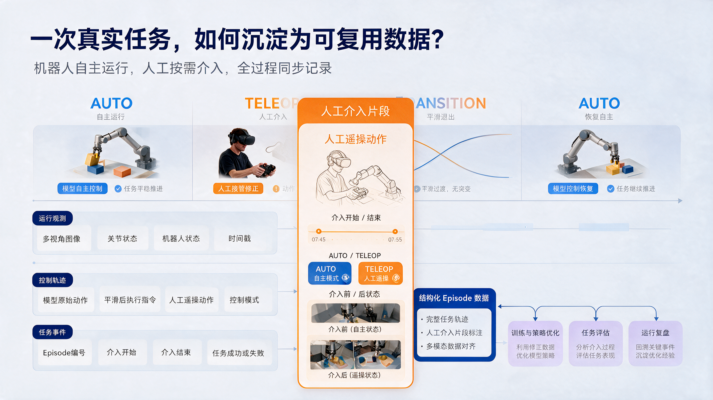

<div align="center">

# OPEN-RAIL

**A Universal Substrate for Asynchronously Linking VLA Model Inference and Robot Execution**

[](https://arxiv.org/abs/2512.24673)
[](LICENSE)
[](pyproject.toml)

[English](README.md) | [中文](README.zh-CN.md)

</div>

<video controls width="100%" preload="metadata">
  <source src="data/media/OPEN-RAIL_demo.mp4" type="video/mp4">
  <a href="data/media/OPEN-RAIL_demo.mp4">Play the OPEN-RAIL demo video</a>
</video>

VLA models are rapidly multiplying, and real-robot deployment is now the accepted path in embodied AI. What remains unresolved is the engineering gap between a model checkpoint and a robot: jerky motion, long-running data loss, and execution data that never feeds back into model iteration.

**OPEN-RAIL is that missing link** — a lightweight server-client framework that connects any VLA model to any adapted robot and closes the loop of **deploy** (run inference on the real robot) → **collect** (capture data as it runs) → **evaluate** (feed data back into iteration) within every single run.

It currently supports **3 heterogeneous robots** (plus a LeRobot simulation backend) and **10 mainstream VLA models**, with joint acceleration standard deviation reduced from **10+ to 0.1 rad/s²**.

- 🤖 **VLA researchers** — a ready-to-use real-robot deployment environment for model innovation without building the pipeline from scratch
- 🔧 **Robotics engineers** — a toolkit for fast algorithm validation without reimplementing drivers and plumbing
- 🎓 **Startups and university labs** — reduce the cost of real-robot experiments and shorten the path from simulation to hardware

---

## Features

| Pain point | What OPEN-RAIL does | Effect |
|---|---|---|
| Inference cannot keep up with the control cycle; motion stutters and jitters | Three-thread asynchronous pipeline (observation / inference / control) + two-level online smoothing (intra-/inter-chunk) | Joint acceleration std **10+ → 0.1 rad/s²**; a **30–50×** frequency gap is eliminated |
| Robot-side compute cannot run large models | Server-client split with non-overlapping dependency trees | Embedded hardware can drive large models; device / edge / cloud switching requires **zero code changes** |
| Every new robot requires a new interface | Lightweight hardware abstraction layer `RobotBase` + unified `action_layout` indexing | **3 heterogeneous robots** adapted; onboarding a new robot from **weeks to hours** |
| Every new model requires rewriting the pipeline | Unified model integration contract + automatic server-side routing | **10 models** supported; new models can be added in **≤ 100 lines** |
| Inference and collection are disjoint; data never reaches training | Collection is built into every inference run; LeRobot-style Parquet with appendable episodes | Usable training data is produced from each run, **at zero extra cost** |
| When inference drifts, there is no way to correct it in time | Three modes (pure inference / pure teleop / hybrid) + pause–intervene–resume with state pre-alignment | Every human correction becomes a **high-quality demonstration** without post-processing |

Smoothing happens at the **framework level** — the model is never modified and no training augmentation is required, so diffusion, flow-matching, and autoregressive architectures are all supported.

<!-- Note: the repository does not include a reproducible report for the robot, task, model, sample size, and hardware behind these smoothing figures. -->

## Quick Start

### 1. Install

```bash
git clone <repository-url>
cd OPEN-RAIL
conda create -y -n open-rail python=3.10 && conda activate open-rail
pip install -e .
```

For compatibility with older workflows, `pip install -r requirements.txt` also works. `pyproject.toml` is the authoritative source for runtime dependencies and console scripts; when the two conflict, it takes precedence.

### 2. Start the server

The server hosts the VLA model runtime and exposes an inference endpoint over ZMQ.

```bash
PYTHONPATH=<project-source-dir>:$PYTHONPATH python run_server.py \
  --model_type <model_type> --model_path <checkpoint_path>
```

### 3. Start the web client

```bash
python run_web_client.py --host 0.0.0.0 --port 9000 --conf default_conf.yaml
```

### 4. Verify

Open http://localhost:9000 in your browser and operate the robot from the UI.

| Argument | Description | Default |
| --- | --- | --- |
| `--host` | Bind address | `0.0.0.0` |
| `--port` | HTTP / UI port | `9000` |
| `--conf` | Config file under `conf/` | `default_conf.yaml` |
| `--model_type` | Registered model adapter, e.g. `tao` | — |
| `--model_path` | Path to the model checkpoint directory | — |

<details>
<summary><b>Full example</b></summary>

```bash
PYTHONPATH=/home/vlamaster2/workspace/projects/TAO/src:$PYTHONPATH \
  python run_server.py --model_type tao \
  --model_path /home/vlamaster2/workspace/checkpoints/porridge/tao_v0_20260616_163634_n8_b64_s30000/checkpoint-30000
```

</details>

<!-- Additional demo media can be added after the test conditions are documented. -->

## Supported Robots

| Robot | Type | Status | Adapter |
|---|---|---|---|
| A2D | Bimanual humanoid (head + waist + wheeled base) | ✅ Adapted | `client/robots/a2d/` |
| Ti5 T170C | Bimanual wheeled robot (ROS 2) | ✅ Adapted | `client/robots/ti5_t170c/` |
| Navi WA2 (Zhejiang Humanoid) | Folding wheel-legged humanoid (ROS 1) | ✅ Adapted | `client/robots/navi_wa2/` |
| Mock | LeRobot-based simulation backend | ✅ Adapted | `client/robots/mock/` |
| _Your robot_ | — | 🔜 Planned | [Integration guide](docs/guides/add-new-robot.md) |

## Supported Models

| Model family | Members | Status |
|---|---|---|
| ACT | ACT | ✅ Supported |
| GR00T N1 series | GR00T N1, N1.5, N1.6 | ✅ Supported |
| RDT | RDT-1B | ✅ Supported |
| SmolVLA | SmolVLA | ✅ Supported |
| GO1 | AgiBot GO-1 | ✅ Supported |
| π series | Pi0, Pi0.5 | ✅ Supported |
| TAO | TAO | ✅ Supported |
| _Your model_ | — | 🔜 [Integration guide](docs/guides/add-new-vla-model.md) |

**10 models** across 7 families are supported today; see `server/models/` for the full list.

## Data Collection

"Inference is collection" is the dividing line between OPEN-RAIL and approaches that separate inference from data capture — every run produces data that flows directly into the training pipeline, with no extra collection pass.

- Data is written by the client-side data manager in parallel with the inference path and does not affect control frequency
- **LeRobot-style Parquet** with appendable episodes, suited to long-horizon runs and incremental training
- Segments produced by human intervention are equally high-quality demonstrations without post-processing

```text
data/
└── recording/<task_name>_<YYYYMMDD>/
  ├── data/chunk-000/episode_000000.parquet
  ├── videos/chunk-000/<video_key>/episode_000000.mp4
  ├── meta/episodes.jsonl
  └── eval/
    ├── eval_log.json
    └── eval_log.csv
```

Evaluation logs preserve raw statistics in JSON and aggregate timing fields in CSV. Evaluation tooling lives in `scripts/`.



The repository does not include a downloadable public dataset. Prepare your own LeRobot-format dataset for the Mock backend, and do not commit large checkpoints, raw recordings, or generated logs.

## Architecture


OPEN-RAIL adopts a **server-client distributed architecture** in which the inference path and the visualization path are decoupled and never interfere with each other. The **Server** owns model inference. The **Client** runs on the robot side and is responsible for observation collection, task execution, command dispatch, and data recording, connecting robot configuration to model inference in a single workflow.

Because the Server owns the model environment and the Client owns the robot environment exclusively, the two dependency trees never collide — the CUDA/PyTorch versions the model requires no longer fight the ROS versions the robot drivers require. This is also what makes device/edge/cloud switching a zero-code-change operation: moving the deployment only changes the Server's network address.

```text
.
├── client/                 # Client runtime, robot adapters, recording, and utilities
│   ├── core/               # Observation, inference, control, transport, visualization, and recording
│   ├── robots/             # RobotBase and robot/simulation adapters
│   └── utils/              # Client utilities and visualization tools
├── server/                 # Model runtime and inference service
│   ├── core/               # VLAServer, ZMQServer, and visualization service
│   ├── models/             # VLA model adapters and model-specific implementations
│   └── utils/              # Server utilities
├── conf/                   # Client, server, robot, and recording configuration
├── web_client/             # Web UI, HTTP API, and WebSocket service
├── visual/                 # Standalone visualization assets and data push service
├── extra/                  # Dispatch and communication helpers
├── scripts/                # CUDA, dataset display, and evaluation scripts
├── docs/                   # Getting started, architecture, configuration, troubleshooting, and guides
│   └── guides/             # Robot and VLA model integration guides
├── data/                   # Local data, media assets, and recording output
│   ├── media/              # Demo videos, architecture diagrams, and illustrations
│   └── README.md           # Data directory notes
├── test/                   # Tests and experiments
├── run_server.py           # Server entry point
├── run_web_client.py       # Web client entry point
├── pyproject.toml          # Package metadata and runtime dependencies
├── requirements.txt        # Compatibility dependency list
├── README.md               # English documentation
├── README.zh-CN.md         # Chinese documentation
├── LICENSE                 # Apache License 2.0
└── CITATION.cff            # Citation metadata
```

### Core mechanism: the asynchronous pipeline

Asynchrony here is more than "spawn a thread." The frequency gap between VLA inference and control is orders of magnitude wide: a model needs hundreds of milliseconds to emit one action chunk, while the control loop runs at tens to hundreds of hertz. In a synchronous design, the control cycle's latency floor is the model latency — the root cause of stutter and jitter.

OPEN-RAIL removes that gap with **three decoupled pipelines**:


Each thread runs at its own pace, and none of them wait:

1. **Observation thread** captures camera and proprioceptive data at sensor frequency and streams it upstream to the server without waiting for inference to return
2. **Inference thread** emits action chunks at the model's own pace; the result of one inference pass is reused across many subsequent control cycles
3. **Control thread** executes at control frequency: it interpolates the chunk it already holds, folds in new chunks online as they arrive, and never idles

Once the frequency gap is absorbed, the residual jitter comes from the action chunks themselves — a chunk may be discontinuous internally, and the seam between two chunks can jump. OPEN-RAIL handles this with two levels of online smoothing:

- **Intra-chunk smoothing** — removes discrete jumps inside a single chunk
- **Inter-chunk smoothing** — removes discontinuities at the seam between adjacent chunks

Implementation details (smoothing algorithms and windows, chunk merge policy, degradation policy on inference timeout, buffer structure and capacity) are documented in [docs/architecture.md](docs/architecture.md).

## Documentation

| Document | Description |
| --- | --- |
| [docs/getting-started.md](docs/getting-started.md) | Installation and first run |
| [docs/architecture.md](docs/architecture.md) | Architecture deep dive and async pipeline internals |
| [docs/configuration.md](docs/configuration.md) | Full configuration reference |
| [docs/troubleshooting.md](docs/troubleshooting.md) | Common issues and fixes |
| [docs/guides/add-new-robot.md](docs/guides/add-new-robot.md) | How to add a robot adapter |
| [docs/guides/add-new-vla-model.md](docs/guides/add-new-vla-model.md) | How to add a VLA model adapter |

<!-- TODO: Add ROADMAP.md and ROADMAP.zh-CN.md when the project roadmap is published. -->

## Contributing

Contributions of robot adapters, model adapters, smoothing strategies, and documentation are welcome. Before opening a PR:

1. Open an issue to discuss the change first (especially for new robot/model adapters)
2. Follow the adapter conventions in `docs/guides/`
3. Make sure new code does not break existing robot/model backends

Development setup and checks:

```bash
python -m pip install -e ".[dev]"
python -m pytest
python -m compileall client server conf
git diff --check
```

The repository currently does not configure a dedicated lint or formatting tool. Keep changes scoped and document hardware/model prerequisites for adapter changes.

## Citation

OPEN-RAIL is published under the name **VLA-RAIL** in the following preprint. If you use this project in your research or product prototype, please cite:

```bibtex
@misc{zhao2025vlarailrealtimeasynchronousinference,
  title={VLA-RAIL: A Real-Time Asynchronous Inference Linker for VLA Models and Robots},
  author={Yongsheng Zhao and Lei Zhao and Baoping Cheng and Gongxin Yao and Xuanzhang Wen and Han Gao},
  year={2025},
  eprint={2512.24673},
  archivePrefix={arXiv},
  primaryClass={cs.RO},
  url={https://arxiv.org/abs/2512.24673}
}
```

## License

This project is licensed under the Apache License 2.0. See [LICENSE](LICENSE).

---

**Inference ends where the real robot begins.** Star OPEN-RAIL, join the community, and let models, hardware, and scenarios move together.
