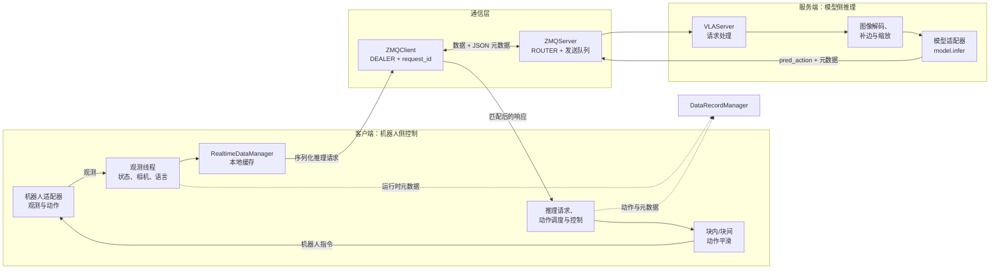

# 架构说明

[English Version](architecture.md)

## 1. 第一性原理

机器人 VLA 系统不断重复下面这个闭环：

```text
观察 -> 推理 -> 调度 -> 执行 -> 再次观察
```

<!-- TODO：补充观察、推理、调度和执行闭环的第一性原理示意图。 -->

每个阶段的节奏和责任主体不同：

- **观察**由机器人和传感器频率决定。
- **推理**由模型计算和加速器吞吐决定。
- **执行**由机器人的控制周期决定。
- **传输**只负责在客户端和服务端之间搬运请求与响应。

架构遵循三条原则：

1. **客户端拥有物理控制闭环**：负责观测采集、本地状态、任务状态、动作调度、平滑和机器人指令。
2. **服务端拥有模型推理**：负责输入准备、模型调用和推理结果生成，不访问机器人硬件，也不执行机器人动作。
3. **通信层拥有消息传输**：负责序列化、路由、请求关联、心跳、发送队列和连接行为，不实现任务策略或控制策略。

因此依赖方向是：

```text
机器人适配器 -> 客户端控制闭环 -> 消息契约 -> 服务端推理 -> 模型适配器
```

这是一条契约边界，而不是要求所有模块运行在同一台机器上。客户端和服务端可以同机运行，也可以在不同环境中通过可达的 ZMQ 地址连接。

## 2. 系统边界图




Web 界面、可视化和数据记录属于实时闭环外围的管理与观测路径。它们应通过明确的 API 和队列工作，不应变成第二条推理传输链路。

## 3. 模块边界

### 3.1 客户端

主要模块：

- `client/core/vla_client.py`：协调观测、推理、控制、可视化、语言任务和数据记录。
- `client/core/realtime_data_manager.py`：保存近期观测和动作块，支持异步处理。
- `client/robots/base_robot.py`：定义机器人侧观测和动作契约。
- `client/robots/`：存放真实硬件或仿真机器人适配器。
- `client/core/intra_chunk_smoother.py`：处理单个预测动作块。
- `client/core/inter_chunk_fuser.py`：结合当前动作、速度和加速度，衔接连续动作块。
- `client/core/zmq_client.py`：客户端使用的通信适配器。

客户端可以知道消息 schema 和服务端状态，但不应依赖模型实现细节。机器人专属映射、SDK 调用、安全检查和物理指令转换都应留在客户端侧。

### 3.2 服务端

主要模块：

- `server/core/vla_server.py`：接收请求、准备图像、提交模型推理并返回结果。
- `server/core/zmq_server.py`：服务端使用的通信适配器。
- `server/models/`：模型适配器和 checkpoint 加载实现。

`VLAServer.inference()` 会解码编码后的相机帧，并将 `model.infer(model_data)` 提交给推理执行器。推理完成回调会补充耗时元数据，再将结果发回请求对应的客户端。

服务端是纯推理边界，不应调用 `retrieve_observation()`、`execute_action()`、机器人 SDK、动作平滑或任务执行代码。模型适配器也不应直接写客户端 socket。

### 3.3 通信层

当前通信实现使用 ZeroMQ：

- `ZMQClient` 使用 DEALER socket，通过 `pickle` 序列化数据 payload，通过 JSON 序列化元数据，并轮询响应。
- `ZMQServer` 使用 ROUTER socket，接收客户端身份和请求，将待发送响应放入发送队列。
- 心跳和测试连接消息由通信层处理，不作为模型响应交给控制循环。
- `request_id` 用于把响应关联到产生它的请求。客户端丢弃过期或不匹配响应，不根据到达顺序猜测请求关系。

ZMQ 是通信边界内部的实现细节。未来替换为 RPC、其他消息队列或共享内存时，应保持相同的领域级请求/响应契约。

### 3.4 数据记录与可观测性

`DataRecordManager` 是客户端侧的管理组件，可以将同一条观测/动作流分别交给两个记录器：

- `LeRobotDatasetRecorder` 写入 episode 数据、Parquet、视频和元数据。
- `EvaluationResultRecorder` 写入任务/子任务评测记录及运行时统计，产物为 `eval/eval_log.json` 和 `eval/eval_log.csv`。

记录过程在 writer process 中异步执行，不应定义推理协议。关闭记录功能不应改变模型请求或机器人指令的语义。

## 4. 异步流水线

模型、传感器和机器人控制的频率通常不同。模型生成一个动作块可能需要几百毫秒，而机器人控制器可能以几十到几百赫兹运行。如果同步等待推理，模型延迟就会直接进入控制循环。

因此客户端把工作拆成独立阶段：

<!-- TODO：补充三线程异步流水线示意图，直观展示观测、推理、控制和队列之间的关系。 -->

```text
观测频率                  推理频率                  控制频率
   │                         │                         │
   ▼                         ▼                         ▼
读取观测 -> 请求队列 -> pred_action -> 动作缓存 -> 执行动作
                         │                         │
                         └------ DataRecordManager --┘
```

实现上使用多个线程和队列，而不是用一个循环串行完成所有工作：

1. 观测线程读取机器人数据，送入原始观测处理链路。
2. 观测处理线程更新 `RealtimeDataManager`，准备记录元数据；启用记录时，把观测/动作对提交给 `DataRecordManager`。
3. 推理线程构造请求并通过 `ZMQClient` 发送，只等待匹配的 `request_id`，结果到达后更新动作缓存。
4. 控制线程按配置的控制周期运行，消费可用动作数据，执行平滑/融合后调用机器人适配器。

队列用于吸收不同阶段的节奏差异，但不代表队列无限，也不代表慢模块永远不会造成丢帧或过期数据。排查延迟时需要同时检查队列容量、超时和降级行为。

## 5. 请求与响应链路

### 5.1 请求

1. `RobotBase.retrieve_observation()` 返回相机和本体感知数据。
2. 客户端处理观测并更新本地状态。
3. 客户端构造推理 payload，并生成唯一 `request_id`。
4. `ZMQClient.sendMessage()` 发送序列化数据和 JSON 元数据。
5. `ZMQServer.recvMessage()` 接收 multipart 消息、记录客户端身份、过滤心跳/测试消息，并将普通请求交给 `VLAServer`。
6. `VLAServer.inference()` 解码相机数据、补边/缩放图像，并调用模型适配器。

### 5.2 响应

1. 模型 future 完成。
2. `VLAServer.inference_callback()` 记录滚动推理耗时并补充响应元数据。
3. `ZMQServer.sendMessage()` 将结果放入发送队列，目标为原始客户端身份。
4. `ZMQClient.recvMessage()` 反序列化结果并过滤心跳响应。
5. 客户端检查 `meta.request_id`；不匹配的响应属于过期响应，会被丢弃。
6. 客户端将 `pred_action` 转换为本地动作表示，应用动作块处理和控制时序，再向机器人适配器下发最终指令。

领域级契约保持简单：

```text
request  = 观测 payload + 请求元数据
response = 模型结果 + 响应元数据
```

`request_id`、心跳状态等传输元数据必须和任务完成、机器人位姿、评分、评测备注等业务状态分开。

## 6. 动作块处理

模型输出是一段未来动作序列，客户端转换后通常表示为 `[action_dim, time_steps]`。客户端不会在模型完成时直接把原始动作块发送给机器人，而是经过两级处理：

```text
模型原始动作块 -> 块内轨迹处理 -> 块间衔接 -> 控制指令
```

块内处理为一次模型结果生成稠密轨迹；块间处理从当前正在执行的位姿、速度和加速度出发，决定如何进入新的轨迹。

### 块内处理

`IntraChunkSmoother.process()` 根据 `config.intra_chunk_mode` 工作。时间步由控制周期（毫秒）转换为秒，返回位姿、速度、加速度、时间戳和可选的任务进度插值结果。

#### `raw`：原始模式

原样返回稀疏动作块和原始时间戳，速度和加速度返回全零数组。该模式用于隔离模型输出，也是评估后续处理效果的基线。

#### `interpolation`：插值模式

通过 `np.arange(start_time, end_time, time_step)` 创建稠密时间网格：

- 渐进动作维度使用 `scipy.interpolate.CubicSpline`；
- 样条的一阶、二阶导数分别作为速度和加速度；
- 阶跃动作维度使用前值保持（零阶保持）插值，速度和加速度设为零。

该模式只改变采样密度，不对整个动作块做全局拟合。

#### `fitting`：拟合模式

动作布局会按策略分流：

- `gradual`：关节或连续动作维度使用多项式批量拟合；
- `stepwise`：夹爪等阶跃维度做局部滤波和插值，不建模速度/加速度；
- `manual`：跳过处理，由机器人/Web 手动控制路径负责。

对于渐进维度，代码使用最小二乘法拟合多项式。给定时间戳 $t_i$ 和关节值 $q_i$：

$$
V C \approx Q^T, \qquad V_{ij}=t_i^{n-j}
$$

其中 $n$ 是配置的拟合阶数 `fitting_deg`，但不会超过样本数减一。拟合结果在稠密时间网格上求值，一阶和二阶多项式导数分别得到速度和加速度：

$$
q(t)=p(t), \qquad v(t)=p'(t), \qquad a(t)=p''(t)
$$

对于阶跃夹爪维度，每个点会用 `2 * filter_window_size + 1` 左右的局部窗口求均值；低于 `min_gripper_action_threshold` 的值映射为 `0`，高于 `max_gripper_action_threshold` 的值映射为 `1`，再在相邻动作点之间采样。夹爪速度和加速度明确设为零。

默认配置使用 `fitting`；`raw` 和 `interpolation` 适合做诊断基线。

### 块间衔接

`InterChunkFuser.process()` 接收新动作块的位姿/速度/加速度、当前机器人状态以及 `target_chunk_index`。第一块没有当前状态，因此实现会根据相邻位置估计离散速度和加速度。后续动作块根据配置选择衔接策略，随后对选定关节维度用有限差分重新计算速度和加速度：

$$
v_k=\frac{q_k-q_{k-1}}{\Delta t}, \qquad a_k=\frac{v_k-v_{k-1}}{\Delta t}
$$

四种模式的目的不同：

#### `search_action`：搜索衔接点

在新动作块中搜索候选点，最多搜索 `search_length` 个时间步，固定步长为 5。对于当前速度超过运动阈值的关节，检查候选点相对当前位置的变化方向是否与当前速度同向；优先选择能让所有运动关节继续当前方向的最早候选点，否则选择满足关节数量最多的候选点。该策略不重塑动作值，只向后移动衔接/起始索引。

#### `smooth_velocity`：速度反馈衔接

从当前状态执行离散的类 PD 跟踪。对每个选定关节和每个未来目标：

$$
a_k=K_p(q_k^{target}-q_k)-K_d v_k
$$

加速度限制在 `[-max_acc, max_acc]`，速度限制在 `[-max_vel, max_vel]`，然后积分：

$$
v_{k+1}=v_k+a_k\Delta t, \qquad q_{k+1}=q_k+v_{k+1}\Delta t
$$

关键参数是 `kp`、`kd`、`max_vel` 和 `max_acc`。该模式优先保证速度/加速度边界，不保证逐点精确跟踪原始动作。

#### `min_jerk`：最小冲击衔接

使用五次多项式，把当前位姿、速度和加速度衔接到新动作块内部的目标状态。衔接长度根据状态差异自适应决定。令位姿、速度、加速度差异的范数为 $d_q,d_v,d_a$，默认负的 `adaptive_factor` 下：

$$
\alpha=\min(1,0.25+d_q+0.75d_v+0.15d_a)
$$

衔接长度为 `int(chunk_length * alpha)`，并限制在当前动作块剩余长度内。归一化的五次基函数同时混合起点和终点的位姿、速度、加速度，因此边界处的位姿、速度和加速度连续。在衔接进度超过 `blend_threshold`（默认 `0.7`）后，结果逐渐混回原始目标动作块。当前实际使用的是向量化 NumPy 实现。

#### `sync`：同步直连

直接复制新动作块，不做块间平滑。未知模式也会记录警告并退化为直接使用新动作块。

块间衔接只处理配置中的 `joint_indices`；阶跃或手动维度可以保留各自处理方式。因此动作布局、衔接索引、当前状态和时间戳间隔都是平滑契约的一部分，而不是通信层的职责。

### 为什么需要两级处理

块内处理解决一次模型结果内部的稀疏采样和不连续；块间处理解决当前正在执行的轨迹与下一次推理结果之间的边界问题，因为新动作块的第一点可能与当前位姿、速度或加速度不一致。只使用其中一级，另一类不连续仍然存在。

`IntraChunkSmoother` 和 `InterChunkFuser` 都属于客户端控制策略，不应放入 ZMQ 序列化代码或模型适配器。不同机器人和运行配置可能使用不同的动作布局与时序。

块内模式总结如下：

- 直接使用原始动作；
- 在动作采样点之间插值；
- 对渐进关节维度做多项式拟合，并计算速度/加速度；
- 对阶跃夹爪维度做阈值化和局部滤波；
- 将手动控制维度交给机器人/Web 控制路径。

## 7. 数据记录与评测链路

启用记录后，客户端把观测、动作、语言、服务端状态和运行时状态传给 `DataRecordManager`。管理器将数据送入常驻 writer process，episode 记录器和评测记录器可以独立处理同一条数据流。

典型产物结构如下：

```text
data/recording/<task_name>_<YYYYMMDD>/
├── data/chunk-000/episode_000000.parquet
├── videos/chunk-000/<video_key>/episode_000000.mp4
├── meta/episodes.jsonl
└── eval/
    ├── eval_log.json
    └── eval_log.csv
```

Episode 数据是高频训练/分析数据；评测记录按任务或子任务总结模型身份、控制配置、耗时、评分、备注和运行时统计。评测 CRUD 命令通过队列发送，由 writer process 串行修改并持久化 JSON/CSV，从而保证真实数据只有一个写入者。

## 8. 扩展规则

### 新增机器人

在 `client/robots/` 下实现 `RobotBase` 适配器，保持观测和动作契约，定义动作布局，并将 SDK 专属代码留在适配器内。条件允许时，先在没有模型服务端的情况下测试观测读取和指令转换。

### 新增模型

在 `server/models/` 下实现模型适配器，提供约定的初始化和 `infer(sequence)` 行为，并在服务端模型工厂中注册类型。checkpoint 加载以及模型专属输入/输出映射应留在服务端模型边界内。

### 替换通信层

针对相同的请求/响应 schema 实现客户端和服务端通信适配器，保持请求关联、超时行为和心跳语义不变。不要把机器人控制或模型推理搬进替代通信层。

## 9. 按边界调试

出现问题时，沿下面链路定位第一个断裂的边界：

```text
机器人观测
  -> 客户端本地状态
  -> 通信请求
  -> 服务端图像准备
  -> 模型推理
  -> 通信响应
  -> 客户端动作处理
  -> 机器人指令
```

这种分离允许进行隔离测试：可以用录制输入测试模型适配器，在没有硬件时测试通信，也可以在没有模型服务端时测试机器人适配器。
