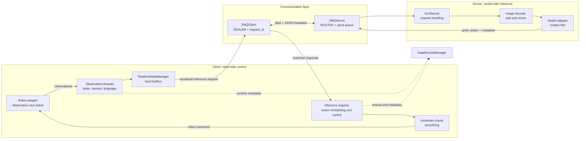

# Architecture


## 1. First Principles

A robot VLA system repeatedly closes this loop:

```text
observe -> infer -> schedule -> execute -> observe again
```

<!-- TODO: Add a first-principles closed-loop diagram for observation, inference, scheduling, and execution. -->

Each stage has a different owner and a different timing requirement:

- **Observation** is controlled by the robot and sensor cadence.
- **Inference** is controlled by model computation and accelerator throughput.
- **Execution** is controlled by the robot control period.
- **Transport** only moves requests and responses between the Client and Server.

The architecture follows three rules:

1. The **Client owns the physical loop**: observation collection, local state, task state, action scheduling, smoothing, and robot commands.
2. The **Server owns model inference**: input preparation, model invocation, and inference result production. It does not access robot hardware or execute actions.
3. The **communication layer owns transport**: serialization, routing, request correlation, heartbeat, send queues, and connection behavior. It does not implement task or control policy.

The resulting dependency direction is:

```text
Robot adapter -> Client control loop -> message contract -> Server inference -> model adapter
```

This is a contract boundary, not a requirement that all components run on one machine. The Client and Server may share a host or run in separate environments connected through a reachable ZMQ endpoint.

## 2. System Boundary



Web UI, visualization, and recording are management and observability paths around the real-time loop. They should use explicit APIs and queues rather than becoming a second inference transport.

## 3. Module Boundaries

### 3.1 Client

Main modules:

- `client/core/vla_client.py`: coordinates observation, inference, control, visualization, language tasks, and recording.
- `client/core/realtime_data_manager.py`: stores recent observations and action chunks for asynchronous processing.
- `client/robots/base_robot.py`: defines the robot-side observation and action contract.
- `client/robots/`: contains hardware or simulation adapters.
- `client/core/intra_chunk_smoother.py`: processes one predicted action chunk.
- `client/core/inter_chunk_fuser.py`: joins consecutive action chunks while considering the current action, velocity, and acceleration.
- `client/core/zmq_client.py`: transport adapter used by the Client.

The Client may know the message schema and Server status, but must not import model implementation details. Robot-specific mappings, SDK calls, safety checks, and physical command conversion belong on this side.

### 3.2 Server

Main modules:

- `server/core/vla_server.py`: receives requests, prepares images, submits model inference, and returns results.
- `server/core/zmq_server.py`: transport adapter used by the Server.
- `server/models/`: model-specific adapters and checkpoint loading.

`VLAServer.inference()` decodes encoded camera frames and submits `model.infer(model_data)` to its inference executor. The completion callback adds timing metadata and sends the result back to the requesting Client.

The Server is a pure inference boundary. It must not call `retrieve_observation()`, `execute_action()`, robot SDKs, action smoothing, or task execution code. A model adapter must not write directly to a Client socket.

### 3.3 Communication layer

The current transport is ZeroMQ:

- `ZMQClient` uses a DEALER socket. It serializes the data payload with `pickle` and metadata with JSON, then polls for responses.
- `ZMQServer` uses a ROUTER socket. It receives the client identity, deserializes the request, and places outgoing responses on a send queue.
- Heartbeat and test-connection messages are handled by the transport layer and are not treated as model responses.
- `request_id` correlates a response with the request that produced it. The Client drops stale or unmatched responses instead of assuming arrival order is correlation.

ZMQ is an implementation detail of the transport boundary. A future RPC, queue, or shared-memory implementation should preserve the same domain-level request/response contract.

### 3.4 Data recording and observability

`DataRecordManager` is a Client-side management component. It can dispatch the same observation/action stream to two recorders:

- `LeRobotDatasetRecorder` writes episode data, Parquet files, videos, and metadata.
- `EvaluationResultRecorder` writes task/subtask evaluation records and runtime statistics to `eval/eval_log.json` and `eval/eval_log.csv`.

Recording is asynchronous and must not define the inference protocol. A disabled recorder should not change the meaning of a model request or robot command.

## 4. Asynchronous Pipeline

The model, sensor, and robot control frequencies are not normally equal. A model may need hundreds of milliseconds to produce an action chunk, while a robot controller may run at tens or hundreds of hertz. Waiting synchronously for inference would put model latency directly on the control loop.

The Client therefore separates work into independent stages:

<!-- TODO: Add an explanatory image for the three-thread asynchronous pipeline. -->

```text
Observation cadence       Inference cadence       Control cadence
       │                         │                       │
       ▼                         ▼                       ▼
retrieve_observation() -> request queue -> pred_action -> action buffer -> execute_action()
                              │                         │
                              └---- DataRecordManager --┘
```

The implementation uses multiple threads and queues rather than one loop that performs every operation serially:

1. The observation thread retrieves robot data and feeds the raw observation pipeline.
2. The observation processing thread updates `RealtimeDataManager`, prepares record metadata, and submits observation/action pairs to `DataRecordManager` when recording is enabled.
3. The inference thread builds a request and sends it through `ZMQClient`; it waits only for the matching `request_id` and updates the action buffer when a result arrives.
4. The control thread runs at the configured control period, consumes available action data, applies smoothing/fusion, and calls the robot adapter.

Queues absorb differences in timing. This reduces coupling, but it does not mean that every queue is unbounded or that a slow component can never cause drops or stale data. Queue size, timeout, and fallback behavior must be considered when diagnosing latency.

## 5. Request and Response Flow

### 5.1 Request

1. `RobotBase.retrieve_observation()` returns camera and proprioception data.
2. The Client processes the observation and updates local state.
3. The Client constructs the inference payload and creates a unique `request_id`.
4. `ZMQClient.sendMessage()` sends serialized data plus JSON metadata.
5. `ZMQServer.recvMessage()` receives the multipart message, tracks the client identity, filters heartbeat/test messages, and forwards a regular request to `VLAServer`.
6. `VLAServer.inference()` decodes camera data, pads/resizes images, and calls the selected model adapter.

### 5.2 Response

1. The model future completes.
2. `VLAServer.inference_callback()` records the rolling inference time and attaches response metadata.
3. `ZMQServer.sendMessage()` enqueues the result for the original client identity.
4. `ZMQClient.recvMessage()` deserializes the result and filters heartbeat responses.
5. The Client checks `meta.request_id`; an unmatched response is stale and is discarded.
6. The Client converts `pred_action` into its local action representation, applies chunk processing and control timing, and sends the final command to the robot adapter.

The domain contract is intentionally small:

```text
request  = observation payload + request metadata
response = model result + response metadata
```

Transport metadata such as `request_id` and heartbeat state must remain separate from business state such as task completion, robot pose, score, or evaluation notes.

## 6. Action Chunk Processing

The model output is a sequence of future actions, commonly represented as `[action_dim, time_steps]` after Client-side conversion. The Client does not send the raw chunk directly to the robot at model completion time. Processing has two stages:

```text
raw model chunk -> intra-chunk trajectory -> inter-chunk transition -> control commands
```

Intra-chunk processing creates a dense trajectory for one model result. Inter-chunk processing starts from the current position, velocity, and acceleration and decides how to enter the new trajectory.

### Intra-chunk processing

`IntraChunkSmoother.process()` uses `config.intra_chunk_mode`. Its time step is the controller period converted from milliseconds to seconds, and it returns position, velocity, acceleration, timestamps, and optionally interpolated task progress.

#### `raw`

Returns the original sparse action chunk and timestamps unchanged. Velocity and acceleration are zero arrays. This is the baseline mode for isolating model output and measuring the effect of later processing.

#### `interpolation`

Creates a dense timestamp grid with `np.arange(start_time, end_time, time_step)`:

- gradual dimensions use `scipy.interpolate.CubicSpline`;
- the first and second derivatives of the spline provide velocity and acceleration;
- stepwise dimensions use previous-sample/zero-order hold interpolation and set velocity and acceleration to zero.

This mode changes the sampling density but does not fit a global model to the whole chunk.

#### `fitting`

The action layout divides dimensions by policy:

- `gradual`: joint or continuous dimensions are fitted independently as a batch with a polynomial;
- `stepwise`: gripper-like dimensions are locally filtered and interpolated, without velocity/acceleration modeling;
- `manual`: dimensions are skipped and remain owned by the robot/Web control path.

For gradual dimensions, the implementation solves a least-squares polynomial fit. With timestamps $t_i$ and joint values $q_i$:

$$
V C \approx Q^T, \qquad V_{ij}=t_i^{n-j}
$$

where $n$ is the configured fitting degree (`fitting_deg`, capped at the number of samples minus one). The fitted position is evaluated on the dense grid, and its first and second polynomial derivatives produce velocity and acceleration:

$$
q(t)=p(t), \qquad v(t)=p'(t), \qquad a(t)=p''(t)
$$

For stepwise gripper dimensions, each point is replaced by a local mean over `2 * filter_window_size + 1` samples, with values below `min_gripper_action_threshold` mapped to `0` and values above `max_gripper_action_threshold` mapped to `1`. The filtered values are then sampled between neighboring action points. Gripper velocity and acceleration are explicitly zero.

The default configuration selects `fitting`; `raw` and `interpolation` are useful diagnostic baselines.

### Inter-chunk transition

`InterChunkFuser.process()` receives the new position/velocity/acceleration chunk, the current robot state, and `target_chunk_index`. The first chunk has no current state, so the implementation estimates discrete velocity and acceleration from adjacent positions. For later chunks it applies the configured transition mode, then recomputes the selected joint dimensions' velocity and acceleration using finite differences:

$$
v_k=\frac{q_k-q_{k-1}}{\Delta t}, \qquad a_k=\frac{v_k-v_{k-1}}{\Delta t}
$$

The four modes have different purposes:

#### `search_action`

Searches candidate points in the new chunk, up to `search_length` with a fixed `search_step` of 5. For joints whose current speed is above the motion threshold, it scores a candidate by whether its position difference has the same sign as the current velocity. It selects the earliest candidate that continues all moving joints when possible, otherwise the candidate with the highest count. The chunk positions are not reshaped; only the transition/start index is moved forward to a more compatible point.

#### `smooth_velocity`

Runs a discrete PD-like tracking update from the current state. For each selected joint and each future target:

$$
a_k=K_p(q_k^{target}-q_k)-K_d v_k
$$

Acceleration is clamped to `[-max_acc, max_acc]`, velocity to `[-max_vel, max_vel]`, and then integrated:

$$
v_{k+1}=v_k+a_k\Delta t, \qquad q_{k+1}=q_k+v_{k+1}\Delta t
$$

The parameters are `kp`, `kd`, `max_vel`, and `max_acc`. This explicitly prioritizes velocity/acceleration limits over exact pointwise tracking.

#### `min_jerk`

Builds a quintic transition from the current position, velocity, and acceleration to a target state inside the new chunk. The transition length is adaptive. With position, velocity, and acceleration differences $d_q,d_v,d_a$ and the default negative `adaptive_factor`:

$$
\alpha=\min(1,0.25+d_q+0.75d_v+0.15d_a)
$$

The transition spans `int(chunk_length * alpha)` samples, limited by the remaining chunk. The normalized quintic basis blends both endpoint positions, velocities, and accelerations, so position, velocity, and acceleration are continuous at the boundary. After `blend_threshold` (default `0.7`) of the transition, the result is gradually blended back toward the original target chunk. The current implementation uses a vectorized NumPy version for this mode.

#### `sync`

Copies the new chunk directly without transition smoothing. Unknown modes also fall back to the new chunk, with a warning.

Only configured `joint_indices` are smoothed by the inter-chunk transition. Stepwise/manual dimensions can retain their own handling. Therefore the action layout, target index, current state, and timestamp spacing are part of the smoothing contract, not transport concerns.

### Why both stages are needed

Intra-chunk processing fixes discontinuities and sparse sampling inside one model result. Inter-chunk processing fixes the boundary between the action currently being executed and the next result, whose first point may disagree with the current position or derivatives. Applying only one stage leaves the other source of discontinuity untreated.

`IntraChunkSmoother` and `InterChunkFuser` are Client-side control policy. They must not be implemented in ZMQ serialization or in a model adapter, because different robots and runtime configurations may need different action layouts and timing.

The available intra-chunk modes are:

- use raw actions;
- interpolate between action samples;
- fit gradual joint dimensions with a polynomial and derive velocity/acceleration;
- process stepwise gripper dimensions with thresholding and local filtering;
- leave manual dimensions to the robot/Web control path.

## 7. Recording and Evaluation Flow

When recording is enabled, the Client passes observation, action, language, server status, and runtime status to `DataRecordManager`. The manager sends the stream to the resident writer process. The writer can feed the episode recorder and evaluation recorder independently.

Typical output is organized by task and date:

```text
data/recording/<task_name>_<YYYYMMDD>/
├── data/chunk-000/episode_000000.parquet
├── videos/chunk-000/<video_key>/episode_000000.mp4
├── meta/episodes.jsonl
└── eval/
    ├── eval_log.json
    └── eval_log.csv
```

Episode data is high-frequency training/analysis data. Evaluation records summarize a task or subtask with model identity, control configuration, duration, score, notes, and runtime statistics. Evaluation CRUD commands are sent through a queue and applied by the writer process so that the persisted JSON/CSV state has one owner.

## 8. Extension Rules

### Add a robot

Implement a `RobotBase` adapter under `client/robots/`. Preserve the observation and action contract, define the action layout, and keep SDK-specific code in the adapter. Test observation and command conversion without requiring a model Server when possible.

### Add a model

Implement a model adapter under `server/models/` with the expected initialization and `infer(sequence)` behavior. Register its type in the Server model factory. Keep checkpoint loading and model-specific input/output mapping inside the Server-side model boundary.

### Replace transport

Implement equivalent Client and Server transport adapters for the request/response schema. Preserve request correlation, timeout behavior, and heartbeat semantics. Do not move robot control or model inference into the replacement transport.

## 9. Debugging by Boundary

When a run fails, locate the first broken boundary in this chain:

```text
robot observation
  -> Client local state
  -> transport request
  -> Server image preparation
  -> model inference
  -> transport response
  -> Client action processing
  -> robot command
```

This separation allows useful isolated tests: recorded input can test a model adapter, a transport test can run without hardware, and a robot adapter can be checked without a model Server.
