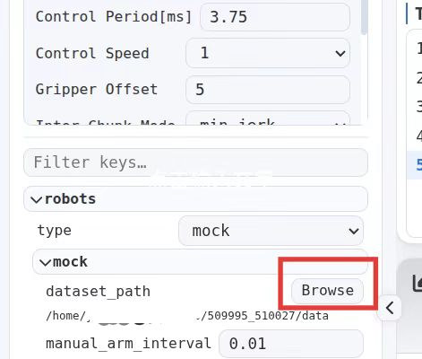
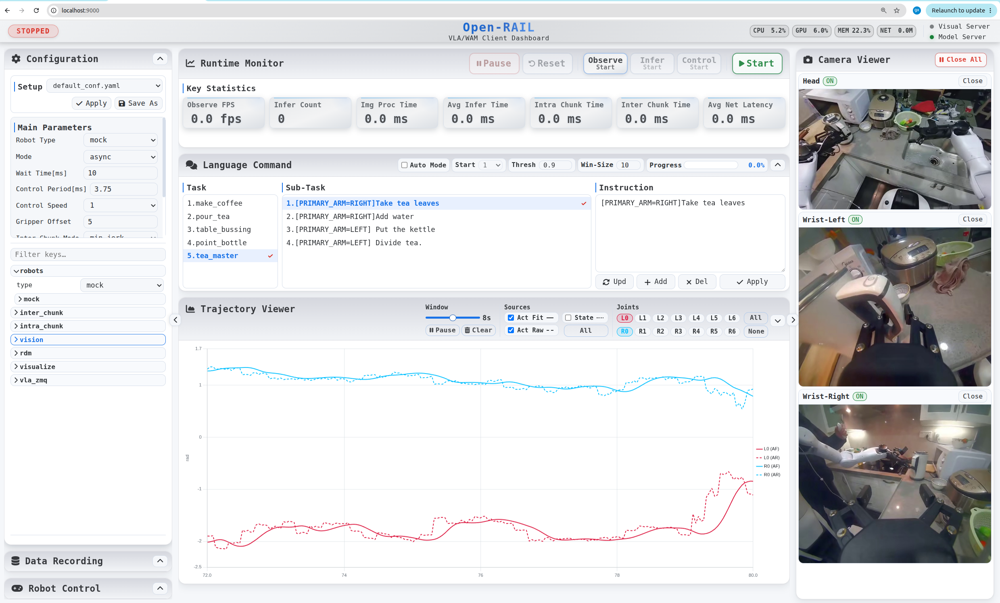

# Running the GR00T‑N1.5 Pretrained Model on the AgiBotWorld 2026 Dataset with RAIL

> 
> Complete deployment pipeline: source code download, dataset preparation, AV1-to-H.264 video transcoding, multiple configuration modifications, server/client startup.
> All `Path/To/xxx` placeholders in this document must be replaced with the real **absolute paths** on your machine.

## 0. Download the RAIL Source Code

RAIL source code local path: `Path/To/RAIL`

## 1. Download the AgiBotWorld 2026 Data Subset

Download the archive:
[https://huggingface.co/datasets/agibot-world/AgiBotWorld2026/blob/main/ImitationLearning/Home/task_4713/509995_510027.tar.gz](https://huggingface.co/datasets/agibot-world/AgiBotWorld2026/blob/main/ImitationLearning/Home/task_4713/509995_510027.tar.gz)

Save it to the local path: `Path/To/Dataset/509995_510027`

## 2. Dataset Preprocessing: Batch-Transcode AV1-Encoded MP4s to H.264

Extract `509995_510027.tar.gz`.
The original videos are AV1-encoded, which OpenCV/Git-LFS cannot read properly, so they need to be transcoded to the H.264 format.

Enter the directory: `Path/To/Dataset/509995_510027/data/videos/chunk-000`, and create the script `transcode_video.sh`:

```
#!/bin/bash
# List of camera directories under Path/To/Dataset/509995_510027/data/videos/chunk-000
cam_dirs=(
"observation.images.hand_left"
"observation.images.hand_right"
"observation.images.head_back_fisheye"
"observation.images.head_left_fisheye"
"observation.images.head_right_fisheye"
"observation.images.top_head"
"observation.images.head_depth"
)
for cam in "${cam_dirs[@]}"; do
    if [ ! -d "$cam" ]; then
	echo "Skip $cam : directory not exist"
	continue
    fi
    echo "==== Process camera dir: $cam ===="
    # Recursively find all episode_*.mp4 files
    find "$cam" -type f -name "episode_*.mp4" | while read -r mp4file; do
	tmpfile="${mp4file}.tmp_transcode.mp4"
	echo "Transcode: $mp4file"
	ffmpeg -i "$mp4file" -c:v libx264 -crf 15 "$tmpfile" -y -hide_banner -loglevel error
	if [ $? -eq 0 ]; then
	    mv "$tmpfile" "$mp4file"
	    echo "OK replaced: $mp4file"
	else
	    echo "FAILED transcode $mp4file , keep original"
	    rm -f "$tmpfile"
	fi
    done
done
echo "All done"
```

Run the transcoding script:

```
chmod +x transcode_video.sh
./transcode_video.sh
```

## 3. Download the GR00T N1.5 Source Code

Branch: `n1.5-release`

Repository: [https://github.com/NVIDIA/Isaac-GR00T/tree/n1.5-release](https://github.com/NVIDIA/Isaac-GR00T/tree/n1.5-release)

Save it to the local path: : `Path/To/Project/Isaac-GR00T-N1.5`

## 4. Download the GR00T-N1.5-3B Pretrained Weights

Weight repository: [https://huggingface.co/nvidia/GR00T](https://huggingface.co/nvidia/GR00T)-N1.5-3B

Save it to the local path: `Path/To/CheckPoint/GR00T-N1.5-3B`

## 5. Modify the RAIL Robot Configuration

File path: `Path/To/RAIL/conf/robots_conf.py` (lines 704-706), modify the `get_mock_config()` function:

```
def get_mock_config():
    """Generate configuration for mock robot (simulation/testing).
    
    Returns:
        ConfigDict: Configuration dictionary containing camera mappings, data root path, and repository ID for mock robot.
    """
    config = ConfigDict()
    config.camera = ConfigDict()
    # config.hand_type = 'gripper' # 'gripper' or 'hand_as_gripper' or 'hand'
    config.camera.ref = 'head'
    config.camera.names = {'head': 'observation.images.head_rgb',
                'hand_left': 'observation.images.left_wrist_rgb',
                'hand_right': 'observation.images.right_wrist_rgb'}
    config.action_layout = _ordered_config({
        'arm': {
            'start': 0, 'end': 14, 'policy': 'gradual',
            'presets': {
                'left': {'Default': [0.0] * 7, 'Custom': [0.0] * 7},
                'right': {'Default': [0.0] * 7, 'Custom': [0.0] * 7},
            },
        },
        'gripper': {
            'start': 14, 'end': 16, 'policy': 'stepwise',
            'presets': {
                'left': {'Default': [0.0], 'Custom': [0.0]},
                'right': {'Default': [0.0], 'Custom': [0.0]},
            },
        },
        'head': {
            'start': 16, 'end': 18, 'policy': 'gradual',
            'presets': {
                    'left': {'Default': [0.0]*2, 'Custom': [0.0]*2},
                    'right': {'Default': [0.0]*2, 'Custom': [0.0]*2},
            },
        },
        'waist': {
            'start': 18, 'end': 20, 'policy': 'gradual',
            'presets': {
                    'left': {'Default': [0.0]*2, 'Custom': [0.0]*2},
                    'right': {'Default': [0.0]*2, 'Custom': [0.0]*2},
            },
        },
        'velocity': {
            'start': 20, 'end': 22, 'policy': 'gradual',
            'presets': {
                    'left': {'Default': [0.0]*2, 'Custom': [0.0]*2},
                    'right': {'Default': [0.0]*2, 'Custom': [0.0]*2},
            },
        },
    })
    config.manual_arm_interval = 0.01
    config.state_action_range = [[0, 16], [58, 70]]
    config.dataset_path = '/home/robot/Music/task_39_only1'
    # config.dataset_path = '/home/robot/Music'
    return config
```

## 6. Modify the RAIL Model Configuration

File path: `Path/To/RAIL/conf/models_conf.py` (lines 36-37), modify `get_gr00t_config()` to set the embodiment tag and the data processing key:

```
def get_gr00t_config():
    """Generate configuration for GR00T model.
    
    Returns:
        ConfigDict: Configuration dictionary containing model path for GR00T.
    """
    config = ConfigDict()
    config.model_path = '/path/to/model'
    config.embodiment_tag = 'agibot_genie1'
    config.data_config_key = 'agibot_genie1'
    return config
```

## 7. Modify the Data Configuration in the GR00T Source Code

File path: `Path/To/Project/Isaac-GR00T-N1.5/gr00t/experiment/data_config.py` (lines 704-706),
modify the `video_keys` of the `AgibotGenie1DataConfig` class:

```
class AgibotGenie1DataConfig(BaseDataConfig):
    video_keys = [
        "video.cam_top_head", "video.cam_left_wrist", "video.cam_right_wrist"
    ]
    ......
```

## 8. Modify the Metadata Configuration Inside the Weights

File path: `Path/To/CheckPoint/GR00T-N1.5-3B/experiment_cfg/metadata.json` (lines 1933-1959),
locate `agibot_genie1` → `modalities` → `video`, and modify the camera-related indices and parameters:

```
"agibot_genie1": {
    ......,
    "modalities": {
        "video": {
            "cam_top_head": {
                "resolution": [
                    640,
                    640
                ],
                "channels": 3,
                "fps": 30.0
            },
            "cam_left_wrist": {
                "resolution": [
                    640,
                    640
                ],
                "channels": 3,
                "fps": 30.0
            },
            "cam_right_wrist": {
                "resolution": [
                    640,
                    640
                ],
                "channels": 3,
                "fps": 30.0
            }
        }
    }
}
```

## 9. Start the RAIL Server

In one terminal (with the virtual environment activated by default), start the RAIL server:

```
PYTHONPATH=Path/To/Project/Isaac-GR00T-N1.5:$PYTHONPATH python run_server.py --model_type gr00t_n1_5 --model_path Path/To/CheckPoint/GR00T-N1.5-3B
```

## 10. Start the RAIL Client

Open a new terminal (with the virtual environment activated by default) and start the RAIL client:

```
python run_web_client.py
```

## 11. Configure the Dataset Path on the Web Page

Access in a browser: `http://localhost:9000`
Click `Browse`, and change `robots-mock-dataset_path` on the left side to the actual dataset path:
`Path/To/Dataset/509995_510027/data`



## 12. Start Inference

Click the `Start` button on the top bar of the page to run inference on the AgiBotWorld2026 subset.



### Key Notes

1. All `Path/To/xxx` must be replaced with real absolute paths on your machine;
2. The videos must be transcoded from AV1 to H.264, otherwise OpenCV will fail to read them;
3. Make sure to add the GR00T-N1.5 source directory to `PYTHONPATH`, otherwise class loading via trust_remote_code will fail;
4. `metadata.json` is an internal file of the pretrained weights; it is recommended to back up the original file before modifying it.