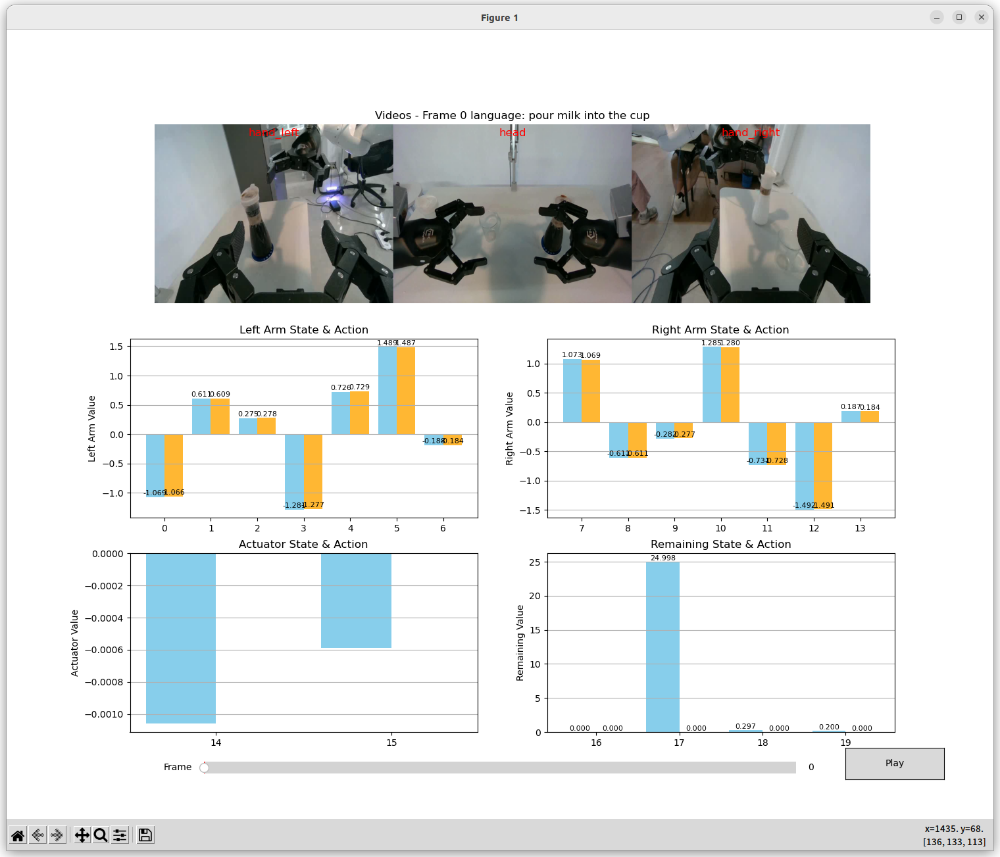
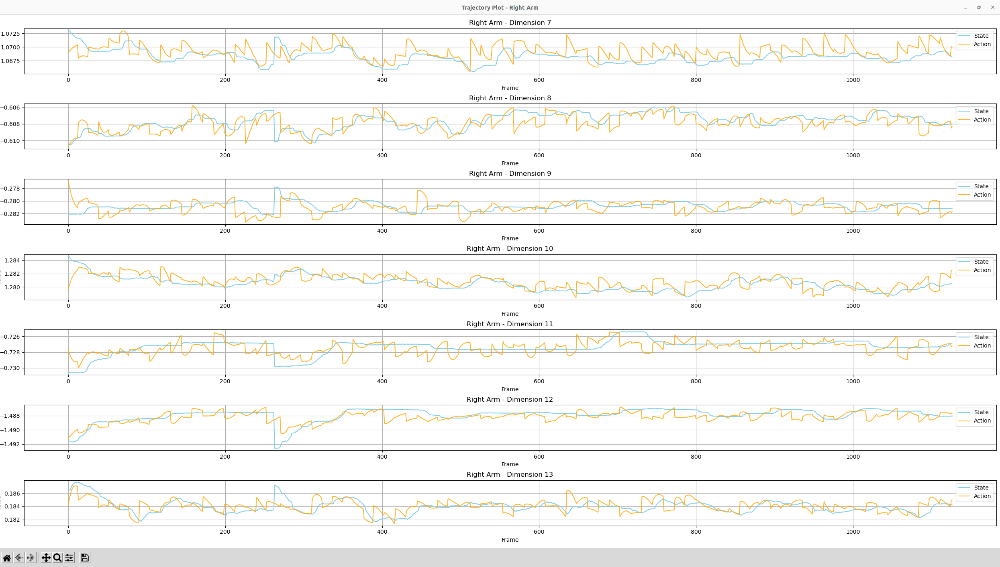
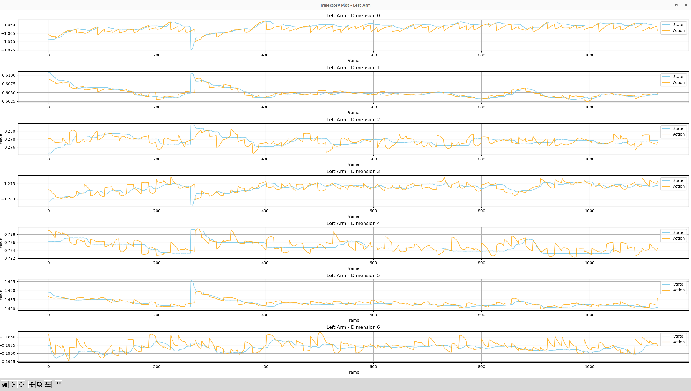

# Dataset Visualization Tool

This tool is used to check saved lerobot datasets and visualize the differences between predicted action data and ground truth data.

## Features

- Supports lerobot format datasets without requiring lerobot dependency, with faster evaluation speed
- Visualizes comparison between predicted and actual values for each joint dimension, along with current frame language
- Regional display of different dimensions for more comfortable visualization

## Prerequisites

- Environment: python3.8+, conda environment
```bash
pip install opencv-python pandas pyarrow numpy matplotlib
```
- Data structure:
```bash
.
├── data
│   └── chunk-000
│       ├── episode_000000.parquet
│       └── .........
├── meta
│   ├── episodes.jsonl
│   ├── info.json
│   └── tasks.jsonl
└── videos
    └── chunk-000
        ├── cam.hand_left
        │   ├── episode_000000.mp4
        │   └── .........
        ├── cam.hand_right
        │   ├── episode_000000.mp4
        │   └── .........
        └── cam.head
            ├── episode_000000.mp4
            └── .........
```
## Usage

```bash
python3 show_data.py \
--data-path /home/rm/wxz/EmbodiedAI/vla_infer_2/vla_infer/data/output/test \
--episode-id 2 \
--chunk-id 0
```

Parameter description
```bash
python show_data.py -h
```

## Notes

None

## Output Example

```
Successfully opened /home/rm/wxz/EmbodiedAI/vla_infer_2/vla_infer/data/output/test/videos/chunk-000/cam.hand_left/episode_000002.mp4, frame count: 1127
Successfully opened /home/rm/wxz/EmbodiedAI/vla_infer_2/vla_infer/data/output/test/videos/chunk-000/cam.head/episode_000002.mp4, frame count: 1127
Successfully opened /home/rm/wxz/EmbodiedAI/vla_infer_2/vla_infer/data/output/test/videos/chunk-000/cam.hand_right/episode_000002.mp4, frame count: 1127
min frame_count : 1127
20
task_index: 1
Update 0, time cost: 149.24235800572205 ms
```




```
Contributors: Xuanzhang Wen
```
