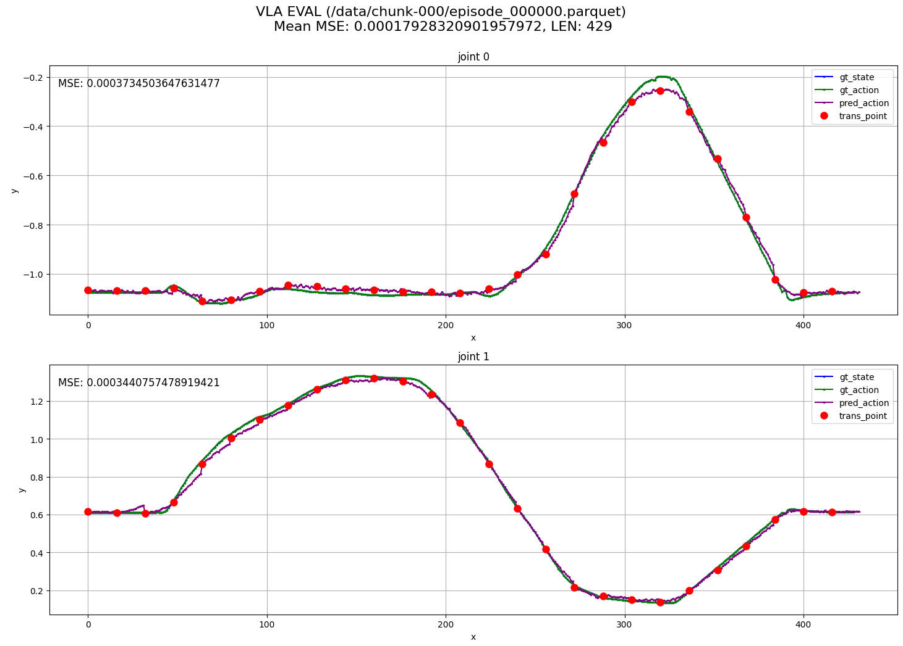

# VLA模型离线评估工具

本工具用于离线评估VLA模型，通过可视化比较模型预测的动作数据和真实数据，帮助分析模型的预测准确性。

## 功能特点

- 支持lerobot格式的gt数据（parquet等），但无需依赖lerobot，且评估速度更快
- 可视化展示每个关节维度的预测值与真实值对比，以及其MSE
- 在每个lookahead_idx处标记红点，lookahead_idx可以设置为chunk_size

## 前提条件

- 本可视化工具依赖：`vla_infer/server/models/<model_name>/vla_model.py`，不同模型的评估需要实现这个文件。
- 不同模型的输入可能不一致，需要修改vis_eval.py中TODO处的obs映射。

## 使用方法

```bash
# 不同模型需修改代码TODO处的obs映射
python vis_eval.py \
--model_path /hy0505/checkpoints/gr00t_finetune/pickbottle_499_chunk64_20250507_192258_b24/checkpoint-60000 \
--gt_root /hy0505/dataset/A2d_zyhy_data/gr00t/task_158284_depth_test/task_158284_test \
--lookahead_idx 64 \
--episode_id 0 \
--chunk_id 0 \
--joint_dim 16 \
--dt_length -1 \
--split_ids 0-7,7-14,14-15 \
--language 'pick bottle into the box' \
--note ''
```

参数说明
```bash
python vis_eval.py -h
```

## 注意事项

暂无

## 输出示例

```
0.05212831497192383 action shape: (64, 16)
使用轨迹0长度：429，平均MSE: 0.00017928320901957972
EVAL图表已保存至: ./img_vis_eval.png
```



```
Contributors: Zhao Lei
```
